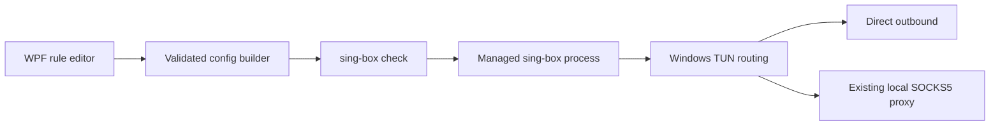

# ProxyManager

[](https://github.com/Lucas-Xi/ProxyManager/actions/workflows/ci.yml)
[](https://github.com/Lucas-Xi/ProxyManager/releases)
[](LICENSE)
[](https://www.microsoft.com/windows)

ProxyManager is an open-source Windows control plane for routing selected applications through an existing local SOCKS5 proxy. It generates a validated [sing-box](https://github.com/SagerNet/sing-box) TUN configuration, starts and supervises the sing-box process, and keeps the default route direct unless a rule says otherwise.

> **Project status: v0.1.1 preview.** The supported app is `ProxyManager.Standalone`. It is useful for testing and early adoption, but it has not yet earned a large user base. Please report compatibility results instead of assuming production readiness.

## Why this exists

Many Windows applications do not expose proxy settings. ProxyManager provides a small, inspectable rule editor for these cases while delegating packet capture and routing to the mature sing-box TUN data plane.

- Route an exact process name through a local SOCKS5 proxy.
- Keep selected applications direct or reject their traffic.
- Narrow a rule by hostname, IP/CIDR, port/range, and TCP/UDP.
- Apply rule changes after `sing-box check` succeeds.
- Show real sing-box runtime logs; no synthetic connection telemetry.
- Encrypt stored proxy passwords with Windows DPAPI for the current user.
- Export profiles without credentials.

## Architecture



ProxyManager does **not** implement a packet driver and does **not** provide a proxy server. It manages a separate sing-box executable and connects to a SOCKS5 service you already run on `127.0.0.1`.

## Requirements

- Windows 10 or Windows 11, x64.
- Administrator rights, required by TUN setup.
- [sing-box v1.13 or newer](https://github.com/SagerNet/sing-box/releases), downloaded separately from its official project.
- An existing SOCKS5 listener on `127.0.0.1` (default port `10808`).
- For source builds: [.NET 8 SDK](https://dotnet.microsoft.com/download/dotnet/8.0).

## Quick start

1. Download `ProxyManager-v0.1.1-win-x64.zip` from [Releases](https://github.com/Lucas-Xi/ProxyManager/releases).
2. Download the official Windows x64 sing-box archive. Put `sing-box.exe` beside `ProxyManager.exe`, add it to `PATH`, or set `PROXYMANAGER_SING_BOX` to its full path.
3. Start your local SOCKS5 service.
4. Run `ProxyManager.exe` as administrator.
5. In Settings, enter the local SOCKS5 port.
6. Drag an `.exe` into the rules page and select Proxy, Direct, or Block.

The status bar reports validation or startup errors. The Monitor page displays sing-box's actual process output with common credential fields redacted.

## Build and test

```powershell
./scripts/test.ps1
./scripts/check-vulnerabilities.ps1
./scripts/build.ps1
```

To validate the generated schema against your installed sing-box version:

```powershell
./scripts/validate-sing-box.ps1 -SingBoxPath C:\path\to\sing-box.exe
```

The same test and publish gates run in GitHub Actions. Release archives are built from a tag and include SHA-256 checksums. sing-box is deliberately not bundled.

## Rule behavior

Rules are evaluated by ascending priority. Supported fields in v0.1.1 are:

| Field | Supported values |
| --- | --- |
| Application | Exact process name, or `*` for all processes |
| Host | Exact hostname or `*.suffix` |
| IP | IPv4/IPv6 address or CIDR |
| Port | Single port or inclusive range |
| Protocol | TCP, UDP, or both |
| Action | Proxy, Direct, or Block |

The default route can be direct or proxy. Proxy chains, failover/load balancing, arbitrary executable wildcards, remote proxy editing, custom DNS controls, and per-connection attribution are not implemented in v0.1.1. Unsupported configurations are rejected instead of silently approximated.

## Configuration and security

Application configuration is stored at `%APPDATA%\ProxyManager\config.json`. Passwords are protected at rest with DPAPI `CurrentUser`. The generated `%APPDATA%\ProxyManager\sing-box.generated.json` must contain any configured credential in plaintext while sing-box is running. ProxyManager deletes it on stop, clean exit, and unexpected child-process exit; after an application or OS crash, the next launch uses a PID/start-time lease to recover a recorded orphan and removes stale generated files. Cleanup is best effort, so local administrators should still treat the per-user application directory as sensitive. Profile exports omit passwords.

Read [SECURITY.md](SECURITY.md) before reporting a vulnerability and [docs/THREAT_MODEL.md](docs/THREAT_MODEL.md) for security boundaries.

## Contributing

Issues, compatibility reports, tests, documentation, and focused pull requests are welcome. Start with [CONTRIBUTING.md](CONTRIBUTING.md), follow the [Code of Conduct](CODE_OF_CONDUCT.md), and see the [roadmap](ROADMAP.md).

## 中文说明

ProxyManager 是一个 Windows 开源分流控制工具。它把应用规则转换为 sing-box TUN 配置，并在配置校验通过后管理 sing-box 进程。当前 v0.1.1 只支持连接本机已有的 SOCKS5 服务，默认地址为 `127.0.0.1:10808`；软件本身不提供代理节点，也不内置或下载 sing-box。

使用前请单独从 sing-box 官方项目下载 `sing-box.exe`，放到 `ProxyManager.exe` 同目录，然后以管理员身份运行。当前是早期预览版，请优先在测试环境验证，并通过 GitHub Issues 反馈 Windows 版本、sing-box 版本、复现步骤和脱敏日志。

## License

ProxyManager is licensed under the [MIT License](LICENSE). sing-box is a separate GPL-licensed program and is not included in this repository or its release archives; see [THIRD_PARTY_NOTICES.md](THIRD_PARTY_NOTICES.md).
